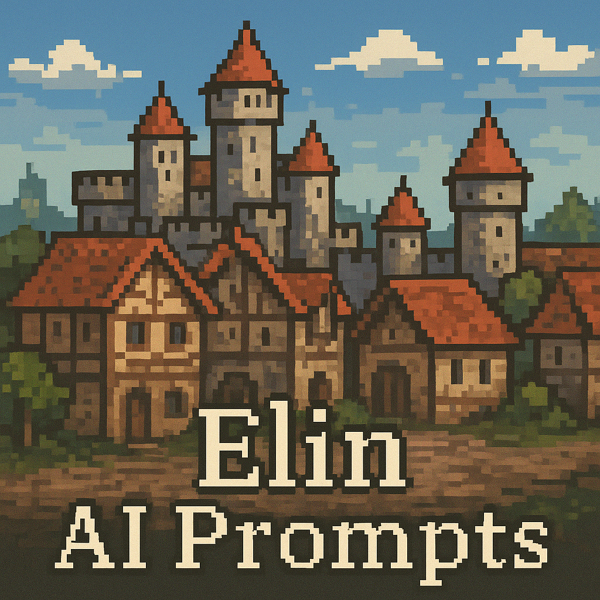

<h2 align="center">
  Elin AI Prompts
</h2>

  

  
これは Elin with AI にて使用する Prompt のまとめです。 

## 機能(Feature)
* 街の情報に関する Prompt を Elin に追加します。

## 対応している街の情報(Supported Town Info)
* ミシリア
* ウィロウ
* オルヴィナ
* アクリ・テオラ
* ダルフィ
* ポート・カプール
* ヨウィン
* パルミア
* ルミエスト
* ミフの里
* スペクウィング
* ネフの里
* ノイエル

## 使い方(Usage)
Elin を起動し、Emmersive設定画面を開き、

1. 「プロンプト設定」を選択  
2. 「フォルダを開く」を選択し、Elin のローカルフォルダを開く  
3.  当リポジトリの Emmersiveフォルダをローカルフォルダにコピー＆ペースト  
4. これで導入完了です！

上記の手法で、すぐに導入が完了します。

## Required Mods(必須 Mod)
* 必須 Mod として、Elin with AI が必要です。  
[Elin with AI](https://steamcommunity.com/sharedfiles/filedetails/?id=3587340176 "Elin with AI")

## Download as ZIP(zip 形式でダウンロード)
[Release Elin AI Prompts Ver 1.0.0](https://github.com/Ant2357/elin-ai-prompts/releases/tag/v1.0.0 "Release Elin AI Prompts Ver 1.0.0")

## Author
* Ant2357

## License
[MIT license](https://en.wikipedia.org/wiki/MIT_License)

